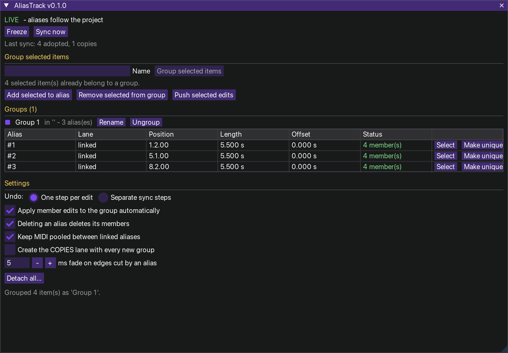

# AliasTrack v0.1.0 – linked item groups inside REAPER folders



One action (`AliasTrack.lua`) opens a ReaImGui window. Select items on tracks inside one folder and **group** them:
an **ALIAS** lane appears as the folder's first track, holding one alias item that spans the selection.
The alias behaves like a normal item whose "source" is the group:

* **move** it – its members move with it
* **trim** it – members are hidden or revealed, never destroyed (extend it again and they are back)
* **split** it, or split / razor-delete **any member** – the whole group is cut at that point
* **copy** it – a *linked* copy: edit a member in one copy and every linked copy follows
* put it on the **COPIES** lane – an *independent* copy with its own edits

## Install
**macOS (or `--portable` anywhere):** close REAPER, then `./install_mac.sh` from this folder (also finds `dist/AliasTrack.lua`).
It copies the script to `Scripts/AliasTrack/`, removes the download quarantine flag and registers the action in `reaper-kb.ini`
(backed up first; skipped if REAPER is running – use `--no-register` to skip it yourself). `./install_mac.sh --uninstall` removes exactly that.

**Manual:** load `dist/AliasTrack.lua` as a ReaScript (*Actions → Show action list → New action → Load ReaScript…*) and run it.
Needs **ReaImGui** (ReaPack → ReaTeam Extensions). Optional: **js_ReaScriptAPI** – syncing then waits until you release the mouse.
Running the action again while the window is open closes it.

## How it works
```
Drums (folder)
  ALIAS · Beat    [ Beat ][ Beat ]          <- linked aliases: all show the same group
  COPIES · Beat           [ Beat #2 ]       <- unique aliases: each its own variant (created on first use)
  Kick            [k   ]  [k   ]  [k   ]
  Snare              [s]     [s]     [s]
  HH              [hhhh]  [hhhh]  [hh--]    <- members are derived from alias + group
```
* The alias item is an **empty MIDI item**: REAPER itself keeps its start offset through trims and splits,
  and that offset is the window into the group.
* **Member edits** – move inside the alias, trim, volume, mute, pitch, rate, fades, move to another track in the folder –
  go into the group automatically (setting), so every linked alias follows.
* Edits that cannot be applied safely mark the alias **MIXED**: a member deleted, dragged past the alias edge, moved out of
  the folder, or trimmed at an edge the alias itself cut. **Apply** makes the group like this alias; **Revert** makes the
  alias like the group.
* FX, envelopes and take changes of a member: select it and press **Push selected edits**.
* **Add selected to alias** / **Remove selected from group** change the group's content.
* **Flatten** turns one alias back into plain items; **Ungroup** does it for all and removes the lanes;
  **Detach all** removes every tag and leaves everything else as it is.
* Identity comes from `P_EXT` tags, never from names: rename tracks and items freely.

## Undo
* **One step per edit** (default): syncs add no undo points. Ctrl+Z undoes *your* edit and the aliases are derived again.
* **Separate sync steps**: each sync is an undo point "AliasTrack: sync"; after undoing one, syncing pauses until you undo
  again or edit something.
* Every button (Group, Make unique, Apply …) is one undo step.

## Settings
Freeze / Go live · undo mode · apply member edits automatically · deleting an alias deletes its members ·
keep MIDI pooled between linked aliases · create the COPIES lane with every group · fade length on edges cut by an alias.

## Development
`./tools/run_tests.sh` builds `dist/AliasTrack.lua` and runs the offline tests (Lua 5.3+) against a mock REAPER and an
ImGui stub. `DESIGN.md` explains the model and the open questions; `spikes/` lists what still has to be confirmed in real
REAPER, with a probe script for the main assumptions.

MIT licence.
